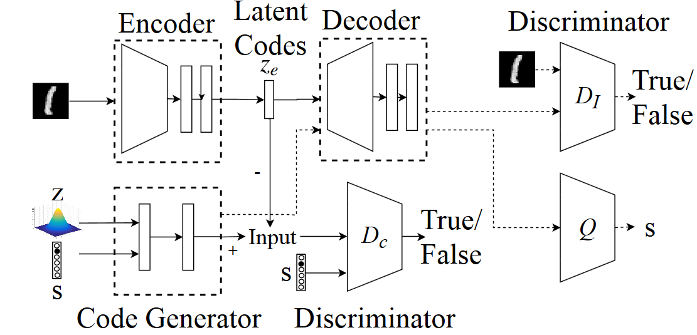
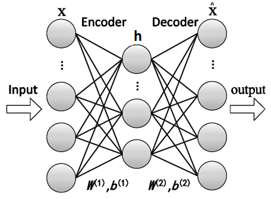

## Autoencoders

### Table of Content
* [Introduction](#introduction)
* [Vanilla Encoder Decoder model and its variants](#vanilla-encoder-decoder-model-and-its-variants)
* [Regularized Autoencoders](#regularized-autoencoders)
* Variational Autoencoder (VAE)
    * Mathematic
        * Loss function Derivation

### Introduction
* Type of Autoencoders
    * Vanilla Encoder Decoder model and its variants
    * Regularized Autoencoders
    * Sparse Autoencoders
    * Denoising Autoencoders
    * Contractive Autoencoders
    * Variational Autoencoders
    * Conditional Variational Autoencoders
    * Adversarial Autoencoders

### Vanilla Autoencoder model and its variants
* Simple Encoder Decoder models.
* Condensed vector representation of Input.
* Autoencoder without activation function and mean squared error as loss function is same as PCA(Principal Component Analysis).
* Sometimes the optimal model comes out to be a linear model(PCA), means without activation functions {it can be proved by using singular value decomposition}.
* Undercomplete and overcomplete Autoencoder
    * **Undercomplete :** Hidden layer (condensed latent vector) has lower dimension then the input.
    * **Overcomplete :** Hidden layer has higher dimension then the input.

    

    

    

* **One Layer Encoder** 

    $$
        \begin{aligned}
        h & = g(a(X)) \\
        & = \sigma(b^{(1)} + W^{(1)}X) 
        \end{aligned}
    $$
* **One Layer Decoder**
    $$
        \begin{aligned}
        \hat{X} & = o(\hat{a}(X)) \\
        & = \sigma(b^{(2)} + W^{(2)}X) 
        \end{aligned}
    $$
* **Loss function and its derivative**
    $$
    \begin{aligned}
        L(\hat{y}, y) &=\frac{1}{n}\sum_{i=1}^{n}(\hat{y_i}-y_i)^2 \tag{1} \\
        \nabla{L(\hat{y}, y)} &=  \hat{y} - y
    \end{aligned}
    $$
    $$
    \begin{aligned}
        L(\hat{y}, y)&=-\sum_{i=1}^{n}(ylog(\hat{y}) + (1-y)log(1-\hat{y})) \tag{2} \\
        \nabla{L(\hat{y}, y)} &=  \frac{\hat{y} - y}{(1-\hat{y})(y)}
    \end{aligned}
    $$

    (1) mean squared error, maximum likelihood, sum squared error, or Squared Euclidean Distance
    (2) Bernoulli negative log-likelihood, or Binary Cross-Entropy

* **Backpropogation(Weight Updation)**

### Regularized Autoencoders
* L1 and L2 Regularization
    * **L1 Regularization** : $L(\hat{y}, y) =\frac{1}{n}\sum_{i=1}^{n}(\hat{y_i}-y_i)^2+\lambda|\theta|$
    * **L2 Regularization** : $L(\hat{y}, y) =\frac{1}{n}\sum_{i=1}^{n}(\hat{y_i}-y_i)^2+\lambda|\theta|^2$
### Denoising Autoencoder
* DAEs take a partially corrupted input and are trained to recover the original undistorted input
* Stocastic mapping procedure is used to corrupt the data
### Sparse Autoencoder
* Sparse autoencoder may include more (rather than fewer) hidden units than inputs, but only a small number of the hidden units are allowed to be active at once.
* **Loss Function**
    $$
    \begin{aligned}
        L(\hat{y}, y) =\frac{1}{n}\sum_{i=1}^{n}(\hat{y_i}-y_i)^2 + \Omega{(h)}\tag{3} 
    \end{aligned}
    $$

    $\Omega{(h)}$ : sparsity penalty 

### Contractive Autoencoder
* **Loss Function**
    $$
    \begin{aligned}
        L(\hat{y}, y) =\frac{1}{n}\sum_{i=1}^{n}(\hat{y_i}-y_i)^2 + \lambda{\sum||\nabla_y{h_i}||^2}\tag{3} 
    \end{aligned}
    $$

    $\lambda{\sum||\nabla_y{h_i}||^2}$ : Frobenius Norm 

### Variational Autoencoder (VAE)

#### Mathematics
* **Loss function Derivation**
    ***Reference Paper** : https://arxiv.org/pdf/1907.08956.pdf*