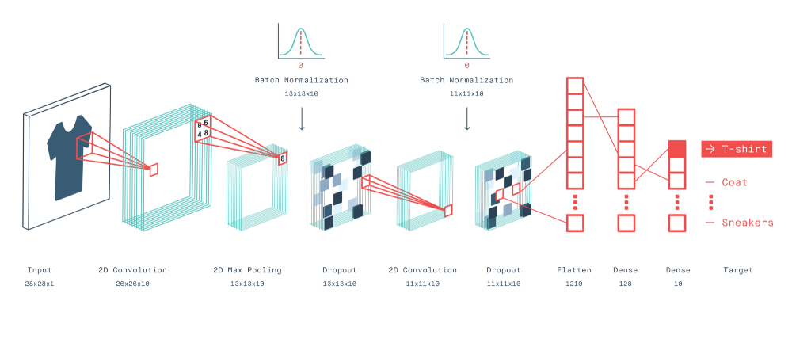
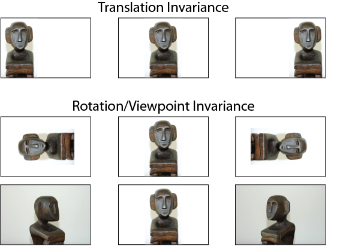
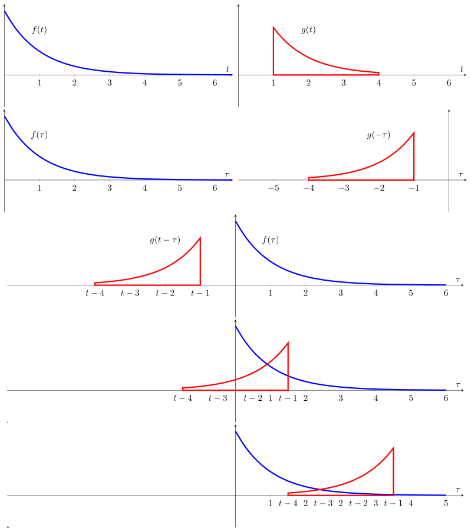

## CNN
Convolutional Neural Networks developed by Yann Lcnn
### Why CNN
* To address the problem of loss of neighborhood information that occurs when input data in 2 dimentinal matrix and single data point share a relationship with its adjusting data points like that happen in Images.

  

* To many learnable parameters in classical neural network. 
    * **Spare Interaction**: There are spare connection between layers unlike feed forward neural network.
    * **Parameter Sharing**: ???
    * **Equivariant Representation**: It eradicate the invariance problem of FDN also.

* **Translation Invariance:** CNN are translational invariance networks means they can classify below images as same.
  

    
    
  

### Mathematics

#### 1D Convolution 

$$(f*g)(t)=\int^{\infty}_{-\infty}f(\tau).g(t-\tau)d\tau$$

**Where;** Right side represents the Area under the intersection of $f(t)$ and $g(t-\tau)$ curves.

* Visual Explanation
    * Express Each function $f(t)$ and $g(t)$ in terms of any dummy variable let's say $\tau$.
    * Reflect and translate one of the function let say $g(t-\tau)$
    * Beginning from the $-\infty$ upto $+\infty$ slide the function $g(-\tau)$ and whenever they intersect compute integral of their multiplication i.e, weighted sum of the funtion $f(\tau)$ where weighing function is $g(-\tau)$.

  

  

  

### Implementation
#### Stanalone CNN block using tensorflow
#### Using keras API
### Examples